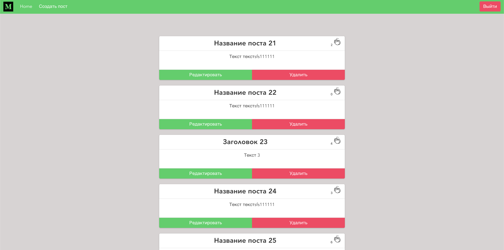

# medium-analog

## Инструкция

```
1. yarn install устанавливаем зависимости
2. Потом нужно запустить локальную базу командой в терминале: json-server --watch db.json
3. В появившийся хост сверяемся хостом в файле src/store/urls.js "http://localhost:3000",
если нет то меняем на нужный
4. yarn serve запускаем проект
```



## Project setup

```
yarn install
```

### Compiles and hot-reloads for development

```
yarn serve
```

### Compiles and minifies for production

```
yarn build
```

### Lints and fixes files

```
yarn lint
```

### Customize configuration

See [Configuration Reference](https://cli.vuejs.org/config/).
